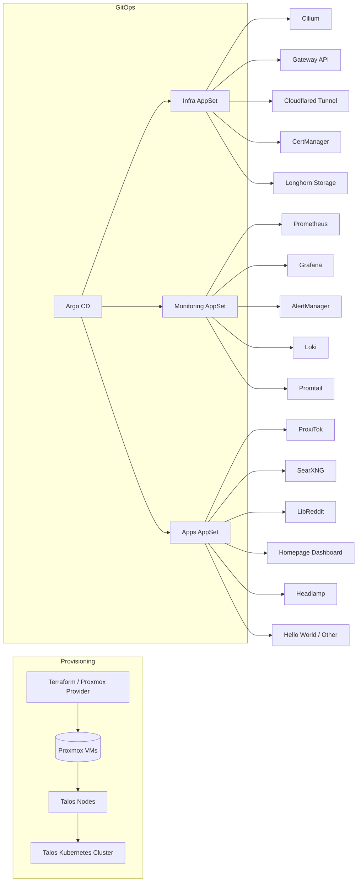

🚀 Talos + Terraform GitOps Starter Kit
======================================

> End-to-end Infrastructure as Code + GitOps workflow: Terraform (Proxmox VM provisioning) → Talos (Kubernetes OS) → Cilium (CNI + L2) → Argo CD (GitOps) → Observability & Apps

This repository is an updated evolution of an older K3s-focused stack. It now centers on **immutable Talos nodes provisioned by Terraform** with a fully declarative GitOps layer. Works on homelab Proxmox clusters (x86) and can be adapted for other environments. ARM SBC notes from the prior version are omitted for clarity, but the GitOps layer is architecture-agnostic.

### 🎥 Prerequisite Tutorial (Part 1)

[](https://youtu.be/AY5mC5rDUcw)

> IMPORTANT: This repository is **Part 2**. Before proceeding, **watch the video above and complete the baseline setup from that guide** (cluster fundamentals, core GitOps concepts). This repo builds on those foundations and replaces the earlier K3s-first approach with a Terraform + Talos provisioning pipeline. If you already have the context, continue below.

## 📋 Table of Contents

- [Prerequisites](#-prerequisites)
- [Architecture](#-architecture)
- [Provisioning Flow](#-provisioning-flow)
- [Quick Start](#-quick-start)
  - [1. Terraform VM Provisioning](#1-terraform-vm-provisioning)
  - [2. Talos Configuration Generation](#2-talos-configuration-generation)
  - [3. Bootstrap Talos Cluster](#3-bootstrap-talos-cluster)
  - [4. Install Cilium](#4-install-cilium-networking)
  - [5. GitOps Bootstrap (Argo CD)](#5-gitops-setup-argo-cd)
  - [6. Monitoring Stack](#6-monitoring-stack)
  - [7. Final App Deployment](#7-final-application-deployment)
- [Security Setup](#-security-setup)
  - [Cloudflare Integration](#cloudflare-integration)
- [Verification](#-verification)
- [Applications](#-included-applications)
- [Contributing](#-contributing)
- [License](#-license)
- [Troubleshooting](#-troubleshooting)

## 📋 Prerequisites

Local workstation tools (Homebrew one-liner below):

- Terraform
- talhelper
- talosctl
- kubectl
- sops + age
- helm
- cilium-cli
- (optional) Lens
- Cloudflare account (DNS + Tunnel)
- Proxmox cluster with API token & SSH access
- Local DNS capability or Cloudflare wildcard + tunnel

Install (macOS):
```bash
brew install terraform talhelper talosctl kubectl sops age helm cilium-cli
```

> NOTE: For detailed Talos/Terraform variable layout see `iac/iac-readme.md`.

## 🏗️ Architecture

High-Level (collapsed diagram below):

- Provisioning: Terraform → Proxmox → Talos nodes → Talos-managed Kubernetes
- GitOps Control Plane: Argo CD drives three ApplicationSets (infra, monitoring, apps)
- Infrastructure Layer: Cilium, Gateway API, Cloudflared, cert-manager, Longhorn
- Observability: Prometheus, Grafana, AlertManager, Loki, Promtail
- Applications: Privacy (ProxiTok, SearXNG, LibReddit) + UI (Homepage, Headlamp, misc)

<details>
<summary><strong>Show Architecture Diagram (Mermaid)</strong></summary>



<sub>Diagram collapsible to reduce README footprint.</sub>
</details>

### Key Features
- **Immutable OS**: Talos nodes declaratively configured, no SSH drift.
- **Infrastructure as Code**: Single Terraform variable file defines cluster topology.
- **Secure Secrets Flow**: `talhelper` + SOPS + age for machine secrets.
- **GitOps Separation**: Distinct Argo CD Projects (infra / monitoring / apps).
- **Ordered Convergence**: Sync waves ensure infra → monitoring → apps.
- **Recreate Strategy for RWO**: Prevents multi-attach PVC issues (see Troubleshooting).

## 🔄 Provisioning Flow
1. Define VM + role metadata in `iac/terraform/talos-cluster/cluster.auto.tfvars`.
2. Provide Proxmox API/token credentials in `credentials.auto.tfvars` (git-ignored).
3. `terraform apply` provisions VM shells (disk, CPU, MAC, static IP assumptions via DHCP config or cloud-init network inside Talos disk image bootstrap).
4. Convert tfvars → `talenv.yaml` with helper script `iac/tfvars-to-talos-env.sh`.
5. Generate & encrypt Talos secrets: `talhelper gensecret | sops -e > talsecret.sops.yaml`.
6. `talhelper genconfig` renders machine + talosconfig under `iac/talos/clusterconfig/`.
7. Apply per-node Talos machine configs (`talosctl apply-config --insecure ...`).
8. Bootstrap control plane → fetch kubeconfig → install Cilium → GitOps bootstrap.

## 🚀 Quick Start

### 1. Terraform VM Provisioning
```bash
cd iac/terraform/talos-cluster

# (EDIT) cluster.auto.tfvars & credentials.auto.tfvars first
# Security: credentials.auto.tfvars is git-ignored

terraform init -upgrade
terraform plan -out=.tfplan
terraform apply .tfplan
```

### 2. Talos Configuration Generation
```bash
cd ../../talos  # now in iac/talos

# Generate env mapping from Terraform-defined nodes
cd .. && sh ./tfvars-to-talos-env.sh && cd talos

# Export age private key (already generated per docs)
export SOPS_AGE_KEY_FILE=$HOME/.config/sops/age/keys.txt

# Generate & encrypt Talos secrets (idempotent if file exists)
talhelper gensecret > talsecret.sops.yaml
sops -e -i talsecret.sops.yaml  # Encrypt in-place

# Render machine + talosconfig artifacts
talhelper genconfig --env-file talenv.yaml
```

### 3. Bootstrap Talos Cluster
```bash
cd iac/talos

# Apply machine configs (first run uses --insecure)
# NOTE: Replace IPs with those from your cluster.auto.tfvars
talosctl apply-config --insecure --talosconfig=./clusterconfig/talosconfig \
  --nodes=192.168.10.101 --file=./clusterconfig/proxmox-talos-cluster-talos-lab-master-00.yaml
talosctl apply-config --insecure --talosconfig=./clusterconfig/talosconfig \
  --nodes=192.168.10.211 --file=./clusterconfig/proxmox-talos-cluster-talos-lab-worker-01.yaml
talosctl apply-config --insecure --talosconfig=./clusterconfig/talosconfig \
  --nodes=192.168.10.213 --file=./clusterconfig/proxmox-talos-cluster-talos-lab-gpu-worker-02.yaml

export TALOSCONFIG=$(pwd)/clusterconfig/talosconfig
talosctl bootstrap --nodes 192.168.10.101
talosctl kubeconfig -n 192.168.10.101 ~/.kube/config
```

### 4. Install Cilium (Networking)
```bash
# Install Cilium CLI if missing
CILIUM_CLI_VERSION=$(curl -s https://raw.githubusercontent.com/cilium/cilium-cli/main/stable.txt)
CLI_ARCH=amd64 && [ "$(uname -m)" = "aarch64" ] && CLI_ARCH=arm64
curl -L --fail --remote-name-all \
  https://github.com/cilium/cilium-cli/releases/download/${CILIUM_CLI_VERSION}/cilium-linux-${CLI_ARCH}.tar.gz{,.sha256sum}
sha256sum --check cilium-linux-${CLI_ARCH}.tar.gz.sha256sum
sudo tar xzvfC cilium-linux-${CLI_ARCH}.tar.gz /usr/local/bin
rm cilium-linux-${CLI_ARCH}.tar.gz*

# Install (Gateway API + L2 announcements enabled via values or flags)
cilium install \
  --helm-set=ipam.mode=kubernetes \
  --helm-set=kubeProxyReplacement=true \
  --helm-set=cgroup.autoMount.enabled=true \
  --helm-set=cgroup.hostRoot=/sys/fs/cgroup \
  --helm-set=k8sServiceHost=192.168.10.101 \
  --helm-set=k8sServicePort=6443 \
  --helm-set=l2announcements.enabled=true \
  --helm-set=externalIPs.enabled=true \
  --set gatewayAPI.enabled=true \
  --helm-set=devices=e+ \
  --helm-set=operator.replicas=1

# Validate
cilium status && cilium connectivity test

# Critical L2 Configuration Note:
# Identify your active NIC interface before applying the Argo CD-managed L2 policy
ip -o link show | awk -F': ' '{print $2}'
```

### 5. GitOps Setup (Argo CD)
```bash
# Install Helm
curl https://raw.githubusercontent.com/helm/helm/main/scripts/get-helm-3 | bash

# Gateway API CRDs
kubectl apply -f https://github.com/kubernetes-sigs/gateway-api/releases/download/v1.3.0/standard-install.yaml
kubectl apply -f https://github.com/kubernetes-sigs/gateway-api/releases/download/v1.3.0/experimental-install.yaml

# Argo CD Bootstrap
kubectl create namespace argocd
kubectl kustomize --enable-helm infrastructure/controllers/argocd | kubectl apply -f -
kubectl apply -f infrastructure/controllers/argocd/projects.yaml

# Wait for Argo CD
kubectl wait --for=condition=Ready pod -l app.kubernetes.io/name=argocd-server -n argocd --timeout=300s

# Get initial password (change immediately!)
ARGO_PASS=$(kubectl get secret argocd-initial-admin-secret -n argocd -o jsonpath="{.data.password}" | base64 -d)
echo "Initial Argo CD password: $ARGO_PASS"

#Generate a New Password:
Use a bcrypt hash generator tool (such as https://www.browserling.com/tools/bcrypt) to create a new bcrypt hash for the password.
Update the argocd-secret secret with the new bcrypt hash.
kubectl -n argocd patch secret argocd-secret -p '{"stringData": { "admin.password": "$2a$10$rgDBwhzr0ygDfH6scxkdddddx3cd612Cutw1Xu1X3a.kVrRq", "admin.passwordMtime": "'$(date +%FT%T%Z)'" }}'
```

### 6. Monitoring Stack (kube-prometheus-stack with Custom Dashboards)

The monitoring stack uses kube-prometheus-stack Helm chart deployed via Argo CD, providing comprehensive Kubernetes and application monitoring with custom dashboard support.

**Components Included:**
- **Prometheus**: Metrics collection and storage with increased memory (1Gi) for cluster monitoring
- **Grafana**: Visualization with custom dashboard auto-discovery via sidecar
- **AlertManager**: Alert handling and routing
- **Node Exporter**: Node-level metrics collection
- **kube-state-metrics**: Kubernetes object state metrics

**Custom Dashboard Management:**
- Dashboard ConfigMaps are automatically discovered using `grafana_dashboard: "1"` labels
- Stored in `monitoring/kube-prometheus-stack/dashboards/` directory
- Includes pre-configured K3s cluster overview and community dashboards
- Tagged with "custom" for easy identification in Grafana

**Access URLs (after DNS/Gateway setup):**
- **Grafana**: `https://grafana.yourdomain.xyz` (default: `admin` / `admin`)
- **Prometheus**: `https://prometheus.yourdomain.xyz`
- **AlertManager**: `https://alertmanager.yourdomain.xyz`

**Storage (with Longhorn):**
- **Prometheus**: `2Gi` with 7-day retention
- **Grafana**: `1Gi` for dashboards and config
- **AlertManager**: `512Mi` for alert state

**For detailed dashboard management, see [`monitoring/kube-prometheus-stack/dashboards/README.md`](monitoring/kube-prometheus-stack/dashboards/README.md).**

---

To add or remove monitoring components, edit `monitoring/monitoring-components-appset.yaml` and comment/uncomment the desired subfolders. Each component is managed as a separate ArgoCD Application in its own namespace.

## 🔒 Security Setup

### Cloudflare Integration

You'll need to create two secrets for Cloudflare integration:
1. DNS API Token for cert-manager (DNS validation)
2. Tunnel credentials for cloudflared (Tunnel connectivity)

#### 1. DNS API Token 🔑
```bash
# REQUIRED BROWSER STEPS FIRST:
# Navigate to Cloudflare Dashboard:
# 1. Profile > API Tokens
# 2. Create Token
# 3. Use "Edit zone DNS" template
# 4. Configure permissions:
#    - Zone - DNS - Edit
#    - Zone - Zone - Read
# 5. Set zone resources to your domain
# 6. Copy the token and your Cloudflare account email

# Set credentials - NEVER COMMIT THESE!
export CLOUDFLARE_API_TOKEN="your-api-token-here"
export CLOUDFLARE_EMAIL="your-cloudflare-email"
export DOMAIN="yourdomain.com"
export TUNNEL_NAME="k3s-cluster"  # Must match config.yaml
```

#### 2. Cloudflare Tunnel 🌐
```bash
# First-time setup only
# ---------------------
# Install cloudflared
# Linux:
wget -q https://github.com/cloudflare/cloudflared/releases/latest/download/cloudflared-linux-amd64.deb
sudo dpkg -i cloudflared-linux-amd64.deb
# macOS:
brew install cloudflare/cloudflare/cloudflared

# Authenticate (opens browser)
cloudflared tunnel login

# Generate credentials (run from $HOME)
cloudflared tunnel create $TUNNEL_NAME
cloudflared tunnel token --cred-file tunnel-creds.json $TUNNEL_NAME

export DOMAIN="yourdomain.com"
export TUNNEL_NAME="k3s-cluster"  # This should match the name in your config.yaml

# Create namespace for cloudflared
kubectl create namespace cloudflared

# Create Kubernetes secret
kubectl create secret generic tunnel-credentials \
  --namespace=cloudflared \
  --from-file=credentials.json=tunnel-creds.json

# SECURITY: Destroy local credentials ( Optional )
rm -v tunnel-creds.json && echo "Credentials file removed"

# Configure DNS
TUNNEL_ID=$(cloudflared tunnel list | grep $TUNNEL_NAME | awk '{print $1}')
cloudflared tunnel route dns $TUNNEL_ID "*.$DOMAIN"
```

### Certificate Management
```bash
# Create cert-manager secrets
kubectl create namespace cert-manager
kubectl create secret generic cloudflare-api-token -n cert-manager \
  --from-literal=api-token=$CLOUDFLARE_API_TOKEN \
  --from-literal=email=$CLOUDFLARE_EMAIL

# Verify secrets
kubectl get secret cloudflare-api-token -n cert-manager -o jsonpath='{.data.email}' | base64 -d
kubectl get secret cloudflare-api-token -n cert-manager -o jsonpath='{.data.api-token}' | base64 -d
```

### 7. Final Application Deployment
```bash
# Apply infrastructure components
# Run from root of git repo
kubectl apply -f infrastructure/controllers/argocd/projects.yaml -n argocd
kubectl apply -f infrastructure/infrastructure-components-appset.yaml -n argocd

# Wait for core services (5-30 mins for certs)
kubectl wait --for=condition=Available deployment -l type=infrastructure --all-namespaces --timeout=1800s

# Deploy monitoring stack
kubectl apply -f monitoring/monitoring-components-appset.yaml -n argocd

# Wait for monitoring components to initialize
echo "Waiting for kube-prometheus-stack to become ready... (this may take a few minutes)"
kubectl wait --for=condition=Available deployment -l app.kubernetes.io/name=grafana -n kube-prometheus-stack --timeout=600s
kubectl wait --for=condition=Available deployment -l app.kubernetes.io/name=kube-state-metrics -n kube-prometheus-stack --timeout=600s
kubectl wait --for=condition=Ready statefulset -l app.kubernetes.io/name=prometheus -n kube-prometheus-stack --timeout=600s

# Deploy applications
kubectl apply -f my-apps/myapplications-appset.yaml
```

## 🔍 Verification
```bash
# Cluster status
kubectl get pods -A --sort-by=.metadata.creationTimestamp

# Argo CD status
kubectl get applications -n argocd -o wide

# Monitoring stack status
kubectl get pods -n kube-prometheus-stack

# Certificate checks
kubectl get certificates -A
kubectl describe clusterissuer cloudflare-cluster-issuer

# Network validation
cilium status --verbose
cilium connectivity test --all-flows
```

**Access Endpoints:**
- Argo CD: `https://argocd.$DOMAIN`
- Grafana: `https://grafana.$DOMAIN`
- Prometheus: `https://prometheus.$DOMAIN`
- AlertManager: `https://alertmanager.$DOMAIN`
- ProxiTok: `https://proxitok.$DOMAIN`
- SearXNG: `https://search.$DOMAIN`
- LibReddit: `https://reddit.$DOMAIN`

## 📦 Included Applications

| Category       | Components                          |
|----------------|-------------------------------------|
| **Monitoring** | Prometheus, Grafana, Loki, Promtail |
| **Privacy**    | ProxiTok, SearXNG, LibReddit        |
| **Infra**      | Cilium, Gateway API, Cloudflared    |
| **Storage**    | Longhorn                            |
| **Security**   | cert-manager, Argo CD Projects      |

## 🤝 Contributing
Contributions welcome! Please:
1. Maintain existing comment structure
2. Keep all warnings/security notes
3. Open issue before major changes

## 📝 License
MIT License - Full text in [LICENSE](LICENSE)

## 🔧 Troubleshooting

**Common Issues:**
```bash
# Certificates not issuing
kubectl logs -n cert-manager -l app=cert-manager

# Tunnel connection failures
cloudflared tunnel info $TUNNEL_NAME
kubectl logs -n cloudflared -l app=cloudflared

# Cilium connectivity issues
cilium status --verbose
cilium hubble ui

# L2 Announcement Problems
ip -o link show | awk -F': ' '{print $2}'  # Verify node interfaces
kubectl describe CiliumL2AnnouncementPolicy -n kube-system
```

**Monitoring Stack Issues:**
```bash
# Check pod status in the kube-prometheus-stack namespace
kubectl get pods -n kube-prometheus-stack

# If pods are stuck, check the Argo CD UI for sync errors.
# Look at the 'kube-prometheus-stack' application.

# Describe a pod to see its events and find out why it's not starting
kubectl describe pod <pod-name> -n kube-prometheus-stack

# Check logs for specific monitoring components
kubectl logs -l app.kubernetes.io/name=grafana -n kube-prometheus-stack
kubectl logs -l app.kubernetes.io/name=prometheus -n kube-prometheus-stack

# Check Grafana sidecar for dashboard loading issues
kubectl logs -l app.kubernetes.io/name=grafana -c grafana-sc-dashboard -n kube-prometheus-stack

# Verify custom dashboard ConfigMaps are labeled correctly
kubectl get configmaps -n kube-prometheus-stack -l grafana_dashboard=1
```

**Multi-Attach Volume Errors (ReadWriteOnce Issues):**
```bash
# PROBLEM: Multiple pods trying to mount the same ReadWriteOnce (RWO) volume
# SYMPTOMS: Pods stuck in Init:0/2 or Pending state with multi-attach errors
# COMMON CAUSE: ArgoCD rolling updates with Replace=true causing resource conflicts

# Check for stuck pods and volume attachment issues
kubectl get pods -A | grep -E "(Init|Pending|ContainerCreating)"
kubectl get volumeattachments
kubectl get pvc -A

# Identify the problematic pod and PVC
kubectl describe pod <stuck-pod-name> -n <namespace>

# IMMEDIATE FIX: Force delete the stuck pod (temporary solution)
kubectl delete pod <stuck-pod-name> -n <namespace> --force --grace-period=0

# PERMANENT SOLUTION: Fix deployment strategies for RWO volumes
# 1. Update ApplicationSet sync options (remove Replace=true)
# 2. Set deployment strategy to 'Recreate' for apps using RWO volumes
# 3. Add RespectIgnoreDifferences=true to prevent unnecessary syncs

# Verify fixes are applied:
# Check ApplicationSet sync options
kubectl get applicationset -n argocd -o yaml | grep -A 10 syncOptions

# Check deployment strategies for RWO volume users
kubectl get deployment grafana -n kube-prometheus-stack -o jsonpath='{.spec.strategy.type}'
kubectl get deployment proxitok-web -n proxitok -o jsonpath='{.spec.strategy.type}'
kubectl get deployment homepage-dashboard -n homepage-dashboard -o jsonpath='{.spec.strategy.type}'
kubectl get deployment redis -n searxng -o jsonpath='{.spec.strategy.type}'

# All should return 'Recreate' for apps using persistent volumes
```

**Key Prevention Strategies:**
- **Use `Recreate` deployment strategy** for any app with ReadWriteOnce volumes
- **Remove `Replace=true`** from ArgoCD ApplicationSet sync options
- **Add `RespectIgnoreDifferences=true`** to prevent unnecessary rolling updates
- **Use `ApplyOutOfSyncOnly=true`** to only update resources that are actually out of sync

**Specific Changes Made to Fix Multi-Attach Errors:**

1. **ApplicationSet Sync Options Updated:**
   ```yaml
   # REMOVED from all ApplicationSets:
   # - Replace=true  # This was causing resource deletion/recreation
   
   # ADDED to all ApplicationSets:
   syncOptions:
     - RespectIgnoreDifferences=true  # Prevents unnecessary syncs
     - ApplyOutOfSyncOnly=true       # Only sync out-of-sync resources
   ```

2. **Deployment Strategy Changes for RWO Volume Apps:**
   ```yaml
   # monitoring/kube-prometheus-stack/values.yaml
   grafana:
     deploymentStrategy:
       type: Recreate  # Added to prevent multi-attach during updates
   
   # my-apps/homepage-dashboard/deployment.yaml
   spec:
     strategy:
       type: Recreate  # Added for RWO volume safety
   
   # my-apps/proxitok/deployment.yaml  
   spec:
     strategy:
       type: Recreate  # Added for cache PVC
   
   # my-apps/searxng/redis.yaml
   spec:
     strategy:
       type: Recreate  # Added for Redis data persistence
   ```


**Why These Changes Work:**
- **`Recreate` vs `RollingUpdate`**: With ReadWriteOnce volumes, `RollingUpdate` tries to start new pods before old ones terminate, causing volume conflicts. `Recreate` ensures complete pod termination first.
- **Removing `Replace=true`**: This ArgoCD option deletes and recreates all resources during sync, triggering unnecessary rolling updates and volume conflicts.
- **`RespectIgnoreDifferences=true`**: Prevents ArgoCD from syncing minor differences that don't affect functionality, reducing unnecessary pod restarts.
- **Sync Wave Ordering**: Monitoring components use sync wave "1" to deploy after infrastructure (wave "-2" and "0"), ensuring proper resource availability.

**Critical L2 Note:**
If LoadBalancer IPs aren't advertising properly:
1. Verify physical interface name matches in CiliumL2AnnouncementPolicy
2. Check interface exists on all nodes: `ip link show dev enp1s0`
3. Ensure Cilium pods are running: `kubectl get pods -n kube-system -l k8s-app=cilium`

**Longhorn Volume Mount Issues:**
```bash
# PROBLEM: Volumes fail to mount with "device busy" or multipath conflicts
# COMMON CAUSE: Linux multipath daemon interfering with Longhorn device management

# Check if multipathd is running (often enabled by default on Ubuntu/Debian)
systemctl status multipathd

# SOLUTION: Disable multipath daemon on all nodes
sudo systemctl disable --now multipathd

# Verify it's stopped
systemctl is-active multipathd  # Should return "inactive"

# After disabling multipathd, restart kubelet to clear any cached device state
sudo systemctl restart k3s  # For K3s
# OR
sudo systemctl restart kubelet  # For standard Kubernetes

# Check Longhorn volume status after restart
kubectl get volumes -n longhorn-system
kubectl get pods -n longhorn-system

# Reference: https://longhorn.io/kb/troubleshooting-volume-with-multipath/
```

All original comments, warnings, and TODOs preserved. Formatting optimized for readability while maintaining technical accuracy.
